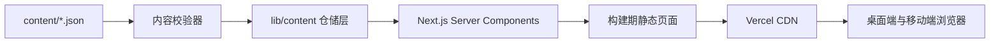
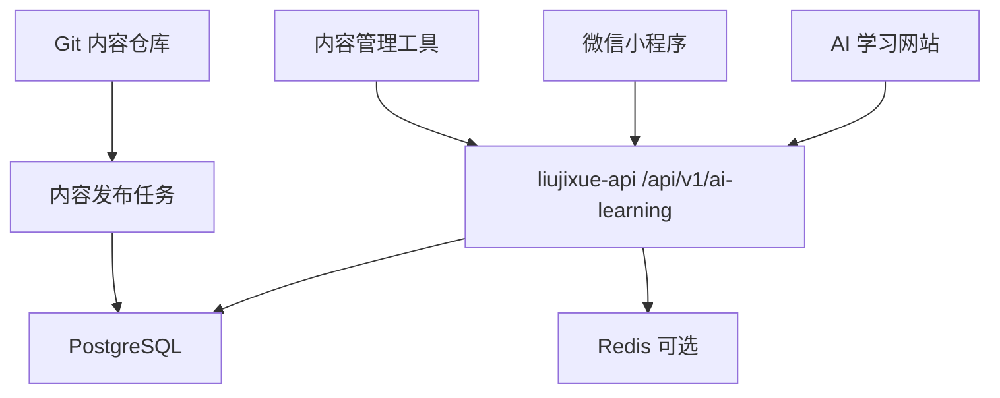
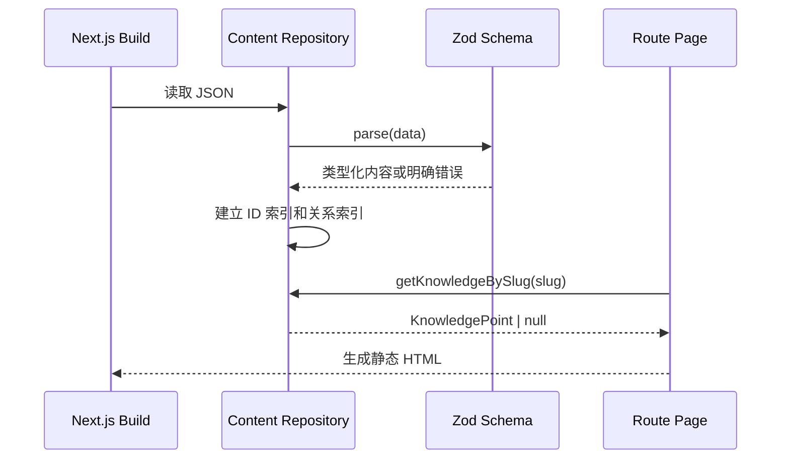

# AI 学习知识库技术设计文档 v1.0

更新时间：2026-07-15  
项目：`liujixue-ai`  
目标域名：`https://ai.liujixue.cn`  
文档状态：实施基线，后续实现必须同步维护

## 1. 文档目的

本文档定义 `liujixue-ai` 的技术架构、代码组织、内容协议、页面实现、质量标准、部署方式和后续演进边界。

它主要解决四个问题：

1. 当前开发者知道每个模块应如何实现。
2. 后续 AI agent 不需要重新设计架构即可继续开发。
3. 网站、未来后台和小程序可以逐步共享同一套内容协议。
4. 每次提交都能通过明确的测试和验收标准判断是否完成。

本文档是技术实现的最高优先级说明。若代码与本文档不一致，应先确认是代码偏离还是设计已经变更；确认设计变更后，必须在同一次提交中更新本文档和 `docs/HANDOFF.md`。

## 2. 技术目标与约束

### 2.1 第一阶段技术目标

- 使用 Next.js App Router 构建可静态生成的内容型网站。
- 首页、学习路线、知识库、面试题、项目和资源页面在无数据库情况下完整可用。
- 所有核心内容进入 Git 版本控制，可审查、回滚和由不同 AI agent 继续维护。
- 构建阶段自动检查内容字段、唯一 ID 和跨内容引用。
- 页面拥有稳定 URL、SEO metadata、站点地图和移动端体验。
- Vercel 部署失败时能从日志快速定位到代码、内容或配置问题。

### 2.2 暂不解决的问题

- 用户登录和跨设备学习进度。
- 收藏、错题本、评论和付费会员。
- 在线内容管理后台。
- 站内 AI 问答和自动面试评分。
- 将所有内容迁移到数据库。

### 2.3 非功能指标

| 指标 | 第一阶段目标 | 验证方式 |
| --- | --- | --- |
| 可用性 | 所有公开路由无 404、无运行时异常 | 路由冒烟测试与构建 |
| 首屏性能 | 移动端 LCP 目标小于 2.5 秒 | Lighthouse 生产环境抽检 |
| 布局稳定 | CLS 目标小于 0.1 | Lighthouse 与截图检查 |
| 可访问性 | 键盘可操作、焦点可见、正文对比度达 WCAG AA | 自动检查加人工检查 |
| 内容完整性 | 构建时不存在重复 ID、断裂引用和必填字段缺失 | 内容校验脚本 |
| SEO | 核心页面拥有 canonical、metadata、sitemap 和 robots | 构建产物与线上 URL 检查 |
| 可交接性 | 新 agent 按文档可在 30 分钟内运行并定位下一任务 | `docs/HANDOFF.md` 演练 |

## 3. 总体架构

### 3.1 当前架构



第一阶段没有业务数据库，也没有业务 API。页面所需内容在构建阶段从仓库读取，并生成静态 HTML。筛选、目录切换等轻量交互在浏览器完成。

### 3.2 未来演进架构



只有出现以下任一真实需求时，才进入后端阶段：

- 需要账号和跨设备进度同步。
- 需要运营人员不改代码即可发布内容。
- 需要小程序与网站实时共享个性化数据。
- 内容规模导致每次构建明显变慢。
- 需要服务端全文搜索、统计或推荐。

“未来可能需要”不是提前引入数据库的理由。

## 4. 技术选型

### 4.1 核心技术

| 领域 | 选型 | 说明 |
| --- | --- | --- |
| Web 框架 | Next.js 15 App Router | 支持静态生成、SEO、Server Components 和 Vercel 部署 |
| 语言 | TypeScript 严格模式 | 降低内容模型和组件属性漂移，方便 AI agent 接手 |
| UI | React 18 + 原生 CSS | 第一版不引入重型组件库，保持视觉控制和较小依赖面 |
| 图标 | Lucide React | 仅在确有图标语义时使用，避免手写 SVG |
| 内容源 | 版本控制内的 JSON | 可审查、可回滚、无需数据库 |
| 运行时校验 | Zod | 构建时校验外部 JSON，不只依赖 TypeScript 静态类型 |
| 测试 | Node Test + Playwright | Node Test 校验数据和纯函数；Playwright 验证页面和移动端 |
| 分析 | Vercel Analytics | 只收集页面级访问数据，不保存答题内容或个人信息 |
| 部署 | Vercel | Preview 与 Production 分离，域名使用 `ai.liujixue.cn` |

### 4.2 暂不采用

- 不使用 Redux。第一版没有复杂全局客户端状态。
- 不使用 Tailwind。现有站点体系更适合自定义设计令牌和语义类名。
- 不使用 CMS。当前内容维护者就是开发者和 AI agent，Git 已能满足审查与回滚。
- 不使用向量数据库。静态知识库没有语义问答需求。
- 不使用 LangChain 或 Agent 框架构建站点本身。它们属于学习内容和示例项目，不是门户运行依赖。

## 5. 代码目录设计

目标目录如下：

```text
liujixue-ai/
├── app/
│   ├── layout.tsx
│   ├── page.tsx
│   ├── globals.css
│   ├── not-found.tsx
│   ├── sitemap.ts
│   ├── robots.ts
│   ├── tracks/page.tsx
│   ├── roadmap/page.tsx
│   ├── knowledge/page.tsx
│   ├── knowledge/[slug]/page.tsx
│   ├── agent/page.tsx
│   ├── interview/page.tsx
│   ├── interview/[id]/page.tsx
│   ├── projects/page.tsx
│   ├── projects/[slug]/page.tsx
│   ├── resources/page.tsx
│   └── journal/page.tsx
├── components/
│   ├── layout/
│   ├── navigation/
│   ├── content/
│   ├── filters/
│   └── ui/
├── content/
│   ├── roadmap.json
│   ├── knowledge-points.json
│   ├── interview-questions.json
│   ├── projects.json
│   ├── career.json
│   ├── training-tracks.json
│   ├── resources.json
│   └── journals.json
├── lib/
│   ├── content/
│   │   ├── schemas.ts
│   │   ├── repository.ts
│   │   ├── relations.ts
│   │   └── filters.ts
│   ├── seo/
│   │   ├── metadata.ts
│   │   └── structured-data.ts
│   ├── site-config.ts
│   └── utils.ts
├── public/
│   ├── images/
│   └── social/
├── scripts/
│   └── validate-content.mjs
├── tests/
│   ├── content-shape.test.mjs
│   ├── content-relations.test.mjs
│   └── e2e/
├── docs/
├── next.config.mjs
├── tsconfig.json
└── package.json
```

目录边界：

- `app/` 只负责路由、页面组合、metadata 和页面级数据获取。
- `components/` 只负责展示和局部交互，不直接读取文件系统。
- `lib/content/` 是内容的唯一读取入口，页面禁止直接 `import` JSON。
- `content/` 只保存内容，不放 UI 配置和业务函数。
- `lib/site-config.ts` 保存站点名称、域名、导航和外部入口等稳定配置。
- `scripts/` 保存 CI 和开发阶段使用的非运行时代码。

## 6. 渲染策略

### 6.1 页面类型

| 页面 | 策略 | 原因 |
| --- | --- | --- |
| 首页 | 静态生成 | 内容来自仓库，更新随部署发布 |
| 学习路线 | 静态生成 | 路线低频更新 |
| 知识点列表 | 静态生成 + 客户端筛选 | 内容公开，筛选无需请求服务端 |
| 知识点详情 | `generateStaticParams` | slug 在构建时已知 |
| 面试题列表 | 静态生成 + 客户端筛选 | 首版不保存答题状态 |
| 面试题详情 | `generateStaticParams` | ID 在构建时已知 |
| 项目列表与详情 | 静态生成 | 项目内容低频更新 |
| 资料导航 | 静态生成 | 由资源 JSON 生成 |
| 学习日志 | 静态生成 | 日志随代码发布 |

### 6.2 Server 与 Client Component 边界

默认使用 Server Component。只有以下场景添加 `'use client'`：

- 分类、难度和标签筛选。
- 移动端导航开关。
- 面试答案展开与收起。
- 复制代码或复制答案。
- 页面内即时搜索。

客户端组件只接收序列化后的数据，不读取 Node 文件 API，不依赖服务端密钥。

### 6.3 缓存规则

第一阶段所有内容随部署更新，不设置运行时 revalidate。构建产物由 Vercel CDN 缓存。内容提交后必须触发一次新部署才能上线。

## 7. 内容系统设计

### 7.1 数据读取流程



### 7.2 仓储层 API

`lib/content/repository.ts` 应提供以下只读函数：

```ts
getRoadmapStages(): RoadmapStage[]
getKnowledgePoints(): KnowledgePoint[]
getKnowledgeBySlug(slug: string): KnowledgePoint | null
getInterviewQuestions(): InterviewQuestion[]
getInterviewQuestionById(id: string): InterviewQuestion | null
getProjects(): PracticalProject[]
getProjectBySlug(slug: string): PracticalProject | null
getResources(): ResourceLink[]
getJournals(): LearningJournal[]
getTrainingTracks(): TrainingTrack[]
```

关系查询放入 `lib/content/relations.ts`：

```ts
getQuestionsForKnowledge(slug: string): InterviewQuestion[]
getProjectsForKnowledge(slug: string): PracticalProject[]
getQuestionsForProject(slug: string): InterviewQuestion[]
getRoadmapDependencies(slug: string): RoadmapStage[]
getTrainingTrackWorkspace(): ResolvedTrainingTrack[]
```

页面只能使用这些函数，不能在页面组件中重复写查找、排序和关系拼装逻辑。

### 7.3 内容校验

校验分三层：

1. 结构校验：字段类型、枚举值、必填字段、URL 格式。
2. 集合校验：ID/slug 唯一、路线 order 唯一、列表非空。
3. 关系校验：`projectRefs`、`relatedQuestions`、`references` 等引用必须存在。

构建必须在校验失败时退出，错误信息至少包含：

- 内容文件。
- 内容 ID 或 slug。
- 字段路径。
- 错误原因。

示例：

```text
content/knowledge-points.json -> agent-loop.relatedQuestions[0]
引用了不存在的面试题：agent-loop-failure
```

### 7.4 内容版本与来源

每条知识点和面试题后续增加以下字段：

```ts
type ContentAuditFields = {
  status: 'draft' | 'reviewed' | 'published'
  lastReviewedAt: string
  sourceUpdatedAt?: string
  authors: string[]
  reviewers: string[]
}
```

发布页面只读取 `published` 内容。第一批数据迁移前，可由仓储层将缺少 `status` 的旧内容临时视为 `published`，但 Batch 2 完成时必须移除兼容逻辑。

引用规则：

- `references` 存资源 ID，不直接在每条内容里复制 URL。
- 技术事实优先引用官方文档。
- 高时效内容必须填写 `lastReviewedAt`。
- 外部资料失效不应导致页面构建失败，但链接检查应给出警告。

## 8. 路由详细设计

### 8.1 `/` 首页

数据：三条训练路径、路线阶段、精选面试题、精选项目、最近日志。
主要组件：`HeroConsole`、`TrainingTrackPreview`、`InterviewPreview`、`ProjectPreview`、`JournalPreview`。
交互：只提供明确入口，不在首页做复杂筛选。  
SEO：标题聚焦“AI Agent 工程学习路线、面试题与项目实战”。

首页不是课程销售页。首屏需要在一个视口内说明：这是给谁的、能学什么、从哪里开始。

### 8.2 `/tracks`

数据：固定 3 条 `TrainingTrack`，关系层把每个任务的知识、题目和项目引用解析成可访问链接。
交互：Hash 直达指定路径；任务完成状态保存在 `localStorage`，键为 `jixue-ai:training-progress:v1`；不登录、不上传用户数据。
完成定义：复选状态只是个人进度，真正完成仍以路径 `acceptanceChecklist` 和项目验收证据为准。
响应式：桌面横向路径切换、任务四列；390px 下路径和任务全部单列，不允许横向滚动。

### 8.3 `/roadmap`

数据：按 `order` 升序的全部路线阶段。  
主要组件：`RoadmapRail`、`StageSection`、`OutputChecklist`。  
交互：移动端按阶段纵向浏览；桌面端可使用吸顶阶段导航。  
错误处理：存在重复 order 或断裂 prerequisite 时构建失败。

### 8.4 `/knowledge`

数据：全部已发布知识点。  
筛选参数：`category`、`level`、`q`。  
URL：筛选状态同步到 query string，分享链接可恢复状态。  
搜索范围：标题、summary、category 和标签；首版使用标准化字符串包含匹配。  
空状态：说明当前筛选没有结果，并提供清除筛选按钮。

### 8.5 `/knowledge/[slug]`

数据：知识点、关联面试题、关联项目、参考资料。  
静态参数：由所有 published knowledge slug 生成。  
404：slug 不存在时调用 `notFound()`。  
页面结构：摘要、重要性、原理、工程实践、示例、误区、面试表达、关联内容、参考资料。

### 8.6 `/agent`

定位：Agent 工程专题地图，不复制知识库列表。  
数据：category 为 `agent`、`mcp`、`eval`、`security` 的知识点和相关项目。  
结构：Agent Loop 主流程、能力地图、可靠性清单、推荐项目和面试题。

### 8.7 `/interview`

数据：全部已发布面试题。  
筛选参数：`category`、`level`、`tag`、`q`。  
默认展示：题目、难度、考察点，答案默认折叠。  
首版状态：刷新后不保存“已掌握”，避免伪造学习系统。

### 8.8 `/interview/[id]`

数据：题目、完整答案、追问、关联项目、参考资料。  
页面应支持分段阅读，短答案与完整答案视觉层级明确。  
禁止：把“复制标准答案”设计成核心目标；页面应帮助用户建立回答结构。

### 8.9 `/projects` 与 `/projects/[slug]`

列表按难度和技术栈筛选。详情页必须包含：问题、目标用户、架构、功能、实现步骤、技术难点、测试策略、部署步骤、验收清单、3 分钟讲解、简历表达和面试追问。

项目实现成熟度使用 `blueprint | prototype | verified`，与内容发布状态分离。列表和详情必须公开当前成熟度及证据；只有 `prototype` 和 `verified` 能显示运行入口，只有 `verified` 能把简历表达标为已完成成果。完整门禁见 `PROJECT_EVIDENCE_AUDIT.md`。

### 8.10 `/labs/prompt-regression`

第一个可运行项目原型。核心评估引擎位于 `lib/labs/prompt-regression.ts`，输入、期望和模型响应均为确定性夹具；页面只负责版本切换与报表呈现。

原型同时区分 Schema 通过与业务字段匹配，输出通过率、P95 延迟和估算成本。固定延迟和成本只验证回归报表，不宣称是真实模型性能。该页不读取密钥、不发网络请求，也不保存用户输入。

### 8.11 `/career`

数据：`career.json` 中的 8 个能力域、8 周计划和有序自测题。关系层负责解析知识、题目和项目引用，引用不存在时内容校验失败。

自测算法完全在浏览器本地执行，不保存用户数据、不调用模型：得分为已确认项占比；按顺序找到首个未确认项，并推荐其 `week` 与 `actionHref`。所有项目交付字段由 Schema 强制至少 3 项。

### 8.12 `/resources`

按路线阶段和来源类型组织。外链必须带 `rel="noopener noreferrer"`。每个资源显示“适合什么时候看”，避免变成链接仓库。

### 8.13 `/journal`

日志按日期倒序。每条记录必须关联一个路线阶段和至少一个产出。后续可增加详情页，但 Batch 1 只做列表。

## 9. 组件设计

### 9.1 布局组件

- `SiteHeader`：品牌、主导航、主站/博客入口、移动端菜单。
- `SiteFooter`：版权、站点矩阵、内容更新时间，不堆叠营销链接。
- `PageShell`：统一页面最大宽度、上下间距和移动端边距。
- `ContentLayout`：正文与目录布局，窄屏自动单列。

### 9.2 内容组件

- `KnowledgeRow`：知识列表行，保持高度稳定，标签不挤压标题。
- `InterviewQuestionRow`：题目摘要、难度和考察点。
- `ProjectCase`：项目不是普通商品卡，应突出架构、难点和求职价值。
- `ReferenceList`：显示来源名、类型、更新时间和外链。
- `RelatedContent`：统一处理知识点、题目、项目的交叉链接。

### 9.3 基础 UI 组件

- `Button` 仅用于动作，链接导航使用 `Link` 样式组件。
- `IconButton` 必须有 `aria-label` 和 tooltip。
- `FilterBar` 在移动端允许换行，不使用横向溢出的固定宽度按钮。
- `Tag` 只表达分类，不把所有短文本都做成胶囊。
- `EmptyState` 提供恢复动作，不写开发过程说明。

### 9.4 属性设计原则

- 组件接收领域对象或明确的 view model，不接收未经约束的 `any`。
- 组件内部不根据中文标题判断业务分支。
- 重复出现两次不立即抽象，出现第三次且结构稳定后再共享。
- 页面级组件不进入 `components/ui`。

## 10. 客户端状态与 URL 状态

首版状态分配：

| 状态 | 保存位置 | 示例 |
| --- | --- | --- |
| 可分享筛选 | URL query | 分类、难度、关键词 |
| 瞬时界面状态 | 组件 state | 导航开关、答案展开 |
| 站点配置 | 服务端常量 | 导航、域名、品牌名 |
| 内容数据 | Git JSON | 知识点、面试题、项目 |
| 用户学习状态 | 不实现 | 收藏、已掌握、错题 |

URL 参数必须有默认值和白名单。遇到未知分类时忽略该参数，不抛出页面异常。

## 11. 搜索设计

第一阶段为本地筛选搜索：

1. 服务端输出必要的列表字段。
2. 客户端将搜索词做 `trim`、小写化和空白标准化。
3. 匹配标题、摘要、标签和分类名称。
4. 不传输完整长答案作为搜索索引，避免首屏 JS 过大。

当知识点超过 300 条或面试题超过 500 条时，评估以下方案：

- 构建期生成轻量搜索索引。
- Pagefind 等静态全文搜索。
- `liujixue-api` 服务端搜索。

不在没有规模问题时引入 Elasticsearch 或向量检索。

## 12. SEO 与结构化数据

### 12.1 基础配置

`lib/site-config.ts` 统一定义：

```ts
export const siteConfig = {
  name: '刘鸡血 AI 学习库',
  shortName: 'Jixue AI Lab',
  url: 'https://ai.liujixue.cn',
  mainSiteUrl: 'https://liujixue.cn',
  blogUrl: 'https://blog.liujixue.cn'
}
```

禁止在多个页面硬编码生产域名。

### 12.2 Metadata 规则

- 首页使用站点级 title。
- 详情页格式：`{内容标题} | 刘鸡血 AI 学习库`。
- description 取人工编写的 summary，不截断正文首段。
- canonical 使用生产域名和稳定路径，不包含筛选 query。
- Open Graph 图片使用统一模板，后续可构建期生成。

### 12.3 结构化数据

- 全站：`WebSite`。
- 知识点详情：`TechArticle`。
- 学习路线：`ItemList`，不冒充有资质认证的 Course。
- 面试题：默认不使用 FAQ schema，除非页面展示形式和搜索引擎规范完全匹配。

### 12.4 Sitemap

只收录 published 内容。筛选 query、草稿和内部预览页不进入 sitemap。

## 13. 视觉系统技术约束

视觉方向：高端知识库 + 工程工作台。它需要专业和克制，但不能像传统后台管理系统。

### 13.1 设计令牌

在 `globals.css` 的 `:root` 中集中定义：

- 页面背景、主文字、次文字、边框、强调色和状态色。
- 4、8、12、16、24、32、48、64 的间距尺度。
- 4、6、8 像素圆角，卡片默认不超过 8 像素。
- 正文、辅助文字、页面标题、章节标题的固定字号层级。
- 统一阴影，不使用发光、渐变球或大面积彩色渐变。

禁止使用纯黑大按钮作为默认主操作。主操作采用高对比但带材质感的深墨色或克制的铜金/钢蓝强调；绿色只用于明确的成功状态。

### 13.2 响应式断点

- 小于 640px：单列，页面边距 16px。
- 640px 到 1023px：单列或 2 列，页面边距 24px。
- 1024px 以上：最大内容宽度约 1200px，正文阅读宽度约 760px。

不使用 viewport 宽度直接缩放字体。固定格式组件必须通过 `grid-template-columns`、`minmax()`、`aspect-ratio` 或明确的最小高度保持稳定。

### 13.3 可访问性

- 页面只能有一个 H1。
- 标题层级不得跳跃。
- 所有表单控件有 label。
- 键盘焦点使用 `:focus-visible` 清晰显示。
- 不只依赖颜色表达难度和状态。
- 动画遵循 `prefers-reduced-motion`。

## 14. 错误处理

### 14.1 构建期错误

内容错误直接阻断构建。禁止在生产页面静默丢弃结构不合法的内容。

### 14.2 页面错误

- 未知详情 ID：返回 `not-found.tsx`，HTTP 状态为 404。
- 未知筛选值：忽略并保留页面可用。
- 外部资源失效：页面继续展示，链接检查任务发出告警。
- 客户端交互异常：核心正文仍应由服务端 HTML 可读。

### 14.3 用户文案

错误文案只说明发生了什么和用户可做什么，不展示堆栈、内部路径或构建信息。

## 15. 安全、隐私与版权

### 15.1 密钥

- 第一阶段前端和构建均不需要模型 API Key。
- Vercel、GitHub 和未来模型密钥只存在本机环境或部署平台 Secret。
- `.env*` 必须被 Git 忽略，只提交 `.env.example`。
- 文档、示例、截图和日志不得包含真实 token。

### 15.2 Web 安全

- 外部链接使用安全 rel 属性。
- 内容不允许插入未经净化的 HTML。
- 不使用 `dangerouslySetInnerHTML` 渲染外部内容。
- 后续若加入 MDX，只允许仓库内受信任内容，并限制可用组件。
- 后续 API 必须做输入长度、速率和来源限制。

### 15.3 隐私

- 第一阶段不采集姓名、邮箱、简历、答题内容。
- Analytics 只做页面访问分析。
- 若未来保存面试答案，必须先增加隐私说明、删除机制和保留期限。

### 15.4 版权

- 不复制付费课程、题库和书籍长文。
- 外部内容使用摘要和链接。
- 面试题答案应基于官方资料与自己的工程实践重新组织。
- 代码示例需注明许可证要求或保持为原创最小示例。

## 16. 测试策略

### 16.1 单元测试

覆盖：

- 内容 schema 校验。
- slug/ID 唯一性。
- 引用完整性。
- 排序和筛选纯函数。
- URL 参数标准化。
- metadata 生成函数。

### 16.2 集成测试

覆盖：

- 仓储层读取真实 JSON 后返回正确领域对象。
- 每个详情 slug 可生成页面参数。
- `sitemap` 只包含 published 内容。
- 草稿不会出现在公开列表。

### 16.3 E2E 测试

Playwright 至少检查：

1. 首页主要入口可到达目标页面。
2. 知识库筛选和清空筛选可用。
3. 面试答案可以展开。
4. 任意知识点详情可打开关联题目。
5. 未知 slug 返回 404。
6. 桌面 1440×900 与手机 390×844 无横向滚动和文字遮挡。
7. header、筛选栏和卡片高度在动态内容下不跳动。

### 16.4 视觉验收

每次影响布局、颜色或组件的提交都要截图检查：

- 首页桌面和手机。
- 内容最多的列表页。
- 最长标题的详情页。
- 空筛选结果。
- 移动端菜单展开状态。

仅 build 通过不代表 UI 验收通过。

## 17. 性能设计

- 默认使用 Server Components，减少客户端 JavaScript。
- 列表页只发送筛选需要的摘要字段。
- 图片使用 Next Image 或预先压缩的静态资源，并声明尺寸。
- 字体优先系统中文字体栈；引入 Web Font 前评估中文字体体积。
- 不在首屏加载代码高亮库；有代码示例时使用构建期高亮。
- 第三方脚本除 Analytics 外默认不接入。

性能预算：

| 项目 | 预算 |
| --- | --- |
| 首页客户端 JS | 目标小于 120 KB gzip |
| 列表页初始内容数据 | 目标小于 100 KB gzip |
| 首屏图片 | 单张目标小于 200 KB |
| 第三方脚本 | 第一阶段最多 1 个 |

超过预算时必须说明原因并记录优化任务。

## 18. 可观测性

第一阶段：

- Vercel 构建日志用于发布故障定位。
- Vercel Analytics 用于查看页面访问。
- Vercel Web Analytics 或 Speed Insights 二选一按需启用，不重复堆统计 SDK。
- 客户端异常暂不接第三方平台；若线上出现不可复现错误，再评估 Sentry。

关注指标：

- 首页到学习路线、面试题和项目页的点击率。
- 搜索无结果率。
- 404 页面访问量。
- 最常访问的知识点和面试题。
- Core Web Vitals。

指标只用于判断内容和导航质量，不在第一阶段建立复杂运营看板。

## 19. CI/CD 与部署

### 19.1 分支和提交

- `main` 为可部署分支。
- 每个批次可以包含多次本地提交，提交应围绕一个可说明的变化。
- 提交前必须检查 `git status`，不得混入其他项目或密钥。
- 不强制 Git Flow；个人项目避免额外分支管理负担。

### 19.2 CI 顺序

```text
npm ci
-> npm run validate:content
-> npm run test:unit
-> npm run lint
-> npm run build
-> Playwright smoke（稳定后加入）
```

任一步失败即停止部署。

### 19.3 环境

| 环境 | 来源 | 域名 | 用途 |
| --- | --- | --- | --- |
| Local | 本机工作区 | `localhost` | 开发与截图检查 |
| Preview | 非生产 Vercel deployment | Vercel preview URL | 提交前验收 |
| Production | `main` 或手动生产部署 | `ai.liujixue.cn` | 正式访问 |

### 19.4 环境变量

第一阶段预留：

```text
NEXT_PUBLIC_SITE_URL=https://ai.liujixue.cn
```

代码必须有生产默认值，以免 Preview 因缺少该变量构建失败；Preview canonical 仍指向正式域名，避免重复收录。

### 19.5 发布和回滚

发布前：

1. 本地测试与 build 通过。
2. Preview 检查核心路由和移动端截图。
3. 检查 sitemap、robots 和 canonical。
4. 再发布 Production。

回滚优先使用 Vercel 上一个成功 deployment 或回滚对应 Git 提交。禁止通过直接修改生产构建产物临时修补。

## 20. 与主站、博客、API 和小程序的集成

### 20.1 站点关系

```text
liujixue.cn              个人主站与站点矩阵入口
blog.liujixue.cn         长文与开发记录
ai.liujixue.cn           AI 学习、题库和项目知识库
xuan.liujixue.cn         玄学排盘工具子站
api.liujixue.cn          未来共享业务 API
微信小程序                未来承载移动端学习和工具入口
```

### 20.2 第一阶段集成

- AI 子站 header 明确提供主站和博客入口。
- 主站 header、首页站点矩阵和项目页提供 AI 子站入口。
- 博客文章可以链接到 AI 知识点，AI 知识点可链接到对应博客深度文章。
- 不通过 iframe 嵌套站点。

### 20.3 未来共享 API 边界

当进入动态阶段时，`liujixue-api` 新增版本化前缀：

```text
GET  /api/v1/ai-learning/catalog
GET  /api/v1/ai-learning/knowledge/{slug}
GET  /api/v1/ai-learning/interview/{id}
GET  /api/v1/ai-learning/projects/{slug}
GET  /api/v1/ai-learning/me/progress
PUT  /api/v1/ai-learning/me/progress/{contentId}
```

约束：

- 网站和小程序共享 DTO，不共享前端组件。
- API 字段使用稳定英文 key，中文只作为内容值。
- API 路径必须带版本号。
- 用户进度与公开内容分表、分缓存策略。
- 未登录用户仍可访问所有公开学习内容。

### 20.4 内容迁移原则

从 Git JSON 迁移数据库时：

1. 保留现有 slug/ID，URL 不变。
2. 编写一次性导入脚本，不手工复制。
3. 数据库增加 `content_version`、`published_at` 和 `updated_at`。
4. API 返回结构尽量与现有 TypeScript 领域模型一致。
5. 网站仓储层从文件实现切换到 API 实现，页面组件不改接口。

## 21. 动态阶段数据设计预案

此节是预案，不代表现在创建数据库。

核心实体：

```text
content_item
- id
- type
- slug
- title
- summary
- status
- content_version
- published_at
- updated_at

content_relation
- source_id
- relation_type
- target_id

user
- id
- external_identity
- created_at

learning_progress
- user_id
- content_id
- state
- last_position
- updated_at

interview_attempt
- id
- user_id
- question_id
- answer
- self_rating
- created_at
```

公开内容可以 CDN 缓存；用户进度不得进入公共缓存。

## 22. 关键技术决策

### ADR-001：静态优先

决定：第一阶段内容使用 Git JSON 并静态生成。  
原因：当前没有账号、实时数据或编辑后台，静态方案成本最低、稳定性最高。  
代价：每次内容更新需要重新部署。  
复审条件：出现动态阶段触发条件。

### ADR-002：采用 TypeScript

决定：页面实现使用 `.tsx`，启用严格模式。  
原因：内容对象关系多，后续由多个 AI agent 维护，类型能降低隐式字段漂移。  
代价：Batch 1 需要补 TypeScript 和类型依赖。

### ADR-003：内容通过仓储层访问

决定：页面不直接 import JSON。  
原因：未来切换 API 或数据库时，页面和组件无需整体重写。  
代价：首版增加少量封装代码。

### ADR-004：不提前实现登录和学习状态

决定：第一阶段不保存用户状态。  
原因：站点当前价值来自路线、内容、题库和项目质量，账号系统不会弥补内容不足。  
复审条件：稳定访问者明确需要跨端进度，且小程序进入开发。

### ADR-005：内容事实必须可追踪

决定：重要技术结论通过资源 ID 关联官方来源和复核日期。  
原因：AI 技术变化快，知识库需要知道内容何时、依据什么被确认。

## 23. 开发批次与 Definition of Done

### Batch 1：可运行骨架

- TypeScript、Zod、Lucide 和测试依赖配置完成。
- layout、导航、footer、首页及 7 个核心路由可访问。
- 内容仓储层和基础 schema 完成。
- sitemap、robots、not-found 完成。
- 单元测试和 build 通过。
- 390px 与 1440px 截图无溢出。

### Batch 2：真实内容列表

- 完成全部 7 个路线阶段。
- 知识、面试题、项目、资源和日志数据可以从 JSON 渲染。
- 筛选同步 URL。
- 内容关系和来源校验完成。
- 列表空状态和长标题通过移动端验收。

### Batch 3：详情和交叉学习

- 三类详情页静态生成。
- 关联内容可互相跳转。
- metadata、canonical 和 structured data 完成。
- 全部内部链接无 404。

### Batch 4：内容质量和求职链路

- 每个路线阶段有学习目标、产出和验收题。
- 每道核心题有考察点、短答、长答、追问和项目关联。
- 每个项目有架构、难点、测试、部署和简历表达。
- 内容具备来源与复核日期。

### Batch 5：上线和站点矩阵接入

- GitHub、Vercel、正式域名配置完成。
- Preview 与 Production 验收完成。
- 主站增加显眼入口。
- Search Console、Bing 和百度按域名状态配置收录。

单个任务只有同时满足以下条件才算完成：

1. 功能按文档实现。
2. 测试覆盖关键风险。
3. build 通过。
4. 桌面和移动端视觉检查通过。
5. 相关文档与交接记录已更新。
6. Git 状态中没有意外文件和密钥。

## 24. 后续 AI Agent 执行规则

任何接手者开始前：

1. 阅读 `README.md`、本文档、`IMPLEMENTATION_PLAN.md` 和 `HANDOFF.md`。
2. 检查 `git status` 和最近 5 次提交。
3. 运行现有测试，确认基线。
4. 只执行当前 Batch 中尚未完成的任务。
5. 修改架构、字段或路由时同步更新本文档。

禁止行为：

- 未读内容模型就批量生成题库。
- 页面直接读取 JSON，绕过仓储层。
- 为了“看起来完整”伪造项目 demo、面试来源或学习进度。
- 在没有测试和截图检查时宣称完成。
- 把 token、服务器密码或真实环境变量写入仓库。
- 用新增大量卡片代替信息架构和内容质量。

## 25. 待确认但不阻塞 Batch 1 的事项

- AI 子站最终中文品牌是否固定为“刘鸡血 AI 学习库”。
- 正式域名是否确定为 `ai.liujixue.cn`。
- 主站导航中 AI 子站入口的最终名称。
- 小程序开发启动时间和身份体系选择。

在这些事项确认前，代码使用 `siteConfig` 集中配置，不将文案散落在组件中，因此不阻塞页面骨架开发。
